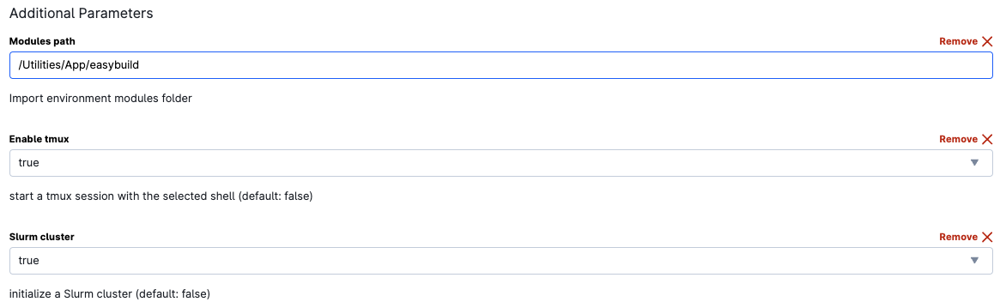

# Overview
This Bash script is designed to perform quality control (QC) on paired-end FASTQ files using various tools, including FastQC, AdapterRemoval, and FastQ_Screen. The script is intended to be executed on a SLURM-based cluster.

# Prerequisites
*	SLURM scheduler
*	Modules: FastQC, AdapterRemoval, FastQ_Screen
*	FastQ_Screen configuration file (provided in /work/References/fastq_screen.conf)

# Usage

1.	Clone Repository and copy the script to your Scripts folder
  ```
  git clone <repository-url> 
  cd <repository-directory> 
  ```

2.	Modify SLURM Parameters (Optional): 
  Open the script (**pe_qc_fastq.sh**) and modify SLURM parameters at the beginning of the file, such as account, output file, email notifications, nodes, memory, CPU cores, and runtime. Alternatively, you can modify these parameters on-the-fly when executing the script.

3. On UCloud, start a **Terminal Ubuntu** run: 
   * Enable **Slurm cluster**
   * To process several samples consider requesting nodes > 1
   * Set the modules path to
    **FGM \> Utilities \> App \> easybuild**

  

   * Include the References folder
  **FGM \> References \> References**

  

   * Include your Scripts folder and the folder with the fastq.gz files.

   * **Notes:** 
     + Match the job CPUs to the amounts requested in the script.
     + If you modify the memory parameter in the script, specify 5-10% less than the memory available in the terminal run.
     + Although it is not necessary to enable **tmux**, it is a good practise to always do it.
     + The configuration file of Fastq_Sreen is also located in the /References folder. 

4. **Run the Script:** Submit the script to the SLURM cluster:

    ```
    sbatch -J <job_name> path_to/Scripts_folder/pe_qc_fastq.sh <input-R1_001.fastq.gz-file> 
    ```
    Replace **input-R1_001.fastq.gz-file** with the full path to your input FASTQ file (R1).

    For several samples you can use a for loop:
    
    ```
    for i in *R1_001.fastq.gz; do sbatch -J <job_name> path_to/Scripts_folder/pe_qc_fastq.sh $i; sleep 1; done
    ```

5.	**Monitor Job:** You can monitor the job using the SLURM commands, such as squeue, scontrol show job <job-id>, and check the log files generated.

# Output
The script creates a directory structure for output files:

* Basename of <input-filename> (Main output directory)
* QC_FASTQC (FastQC results)
* QC_AdapterRemoval (AdapterRemoval results)
* QC_fastq_Screen (FastQ_Screen results)

**Notes:**  
- Ensure that the necessary modules are available on your cluster.  
- Review and customize the script based on your specific requirements.
  